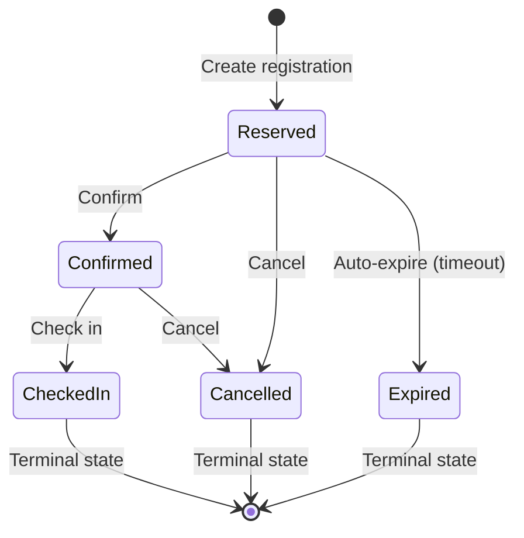

# Phase 2 — Sessions, Registration Lifecycle & Capacity Engine

> **Goals Covered:** #3 (Sessions), #4 (Registration Lifecycle)
> **Estimated Time:** ~3 hours
> **Priority:** 🔴 Critical — this is the business logic heart of the entire system
> **Depends On:** Phase 1 complete

---

## Objectives

1. Build Session CRUD within Events.
2. Implement the full registration state machine (Reserved → Confirmed → Checked In / Expired / Cancelled).
3. Build a race-condition-proof capacity enforcement engine.
4. Implement automated reservation expiry via a background job.
5. Build all corresponding frontend pages and forms.

---

## 2.1 — Sessions Schema & CRUD

### Database Table

```sql
CREATE TABLE sessions (
  id            UUID PRIMARY KEY DEFAULT gen_random_uuid(),
  event_id      UUID NOT NULL REFERENCES events(id) ON DELETE CASCADE,
  title         VARCHAR(255) NOT NULL,
  start_time    TIMESTAMPTZ NOT NULL,
  duration_min  INTEGER NOT NULL CHECK (duration_min > 0),
  location      VARCHAR(255) NOT NULL,   -- room/hall within the venue
  capacity      INTEGER NOT NULL CHECK (capacity > 0),
  created_at    TIMESTAMPTZ DEFAULT NOW(),
  updated_at    TIMESTAMPTZ DEFAULT NOW()
);

CREATE INDEX idx_sessions_event ON sessions(event_id);
CREATE INDEX idx_sessions_start ON sessions(start_time);
```

### API Endpoints

| Method | Endpoint                               | Description              | Roles     |
| ------ | -------------------------------------- | ------------------------ | --------- |
| POST   | `/api/events/:eventId/sessions`        | Create a session         | Organizer |
| GET    | `/api/events/:eventId/sessions`        | List all sessions        | All Auth  |
| GET    | `/api/sessions/:id`                    | Get session details      | All Auth  |
| PATCH  | `/api/sessions/:id`                    | Update session fields    | Organizer |
| DELETE | `/api/sessions/:id`                    | Delete a session         | Organizer |

### Business Rules

- A session's `start_time` must fall within its parent event's `start_date` to `end_date` range.
- Capacity must be a positive integer. Reducing capacity below current active registration count must be rejected with a clear error message.
- Deleting a session with active (non-cancelled, non-expired) registrations should either be blocked or require confirmation — **decide and document in `decisions.md`**.
- Check-in staff **cannot** create, edit, or delete sessions.

---

## 2.2 — Registration State Machine

### Database Table

```sql
CREATE TABLE registrations (
  id            UUID PRIMARY KEY DEFAULT gen_random_uuid(),
  session_id    UUID NOT NULL REFERENCES sessions(id) ON DELETE CASCADE,
  attendee_name VARCHAR(255) NOT NULL,
  attendee_email VARCHAR(255) NOT NULL,
  status        VARCHAR(20) NOT NULL DEFAULT 'reserved'
                CHECK (status IN ('reserved', 'confirmed', 'checked_in', 'cancelled', 'expired')),
  reserved_at   TIMESTAMPTZ DEFAULT NOW(),
  confirmed_at  TIMESTAMPTZ,
  checked_in_at TIMESTAMPTZ,
  cancelled_at  TIMESTAMPTZ,
  expired_at    TIMESTAMPTZ,
  created_by    UUID REFERENCES users(id),
  created_at    TIMESTAMPTZ DEFAULT NOW(),
  updated_at    TIMESTAMPTZ DEFAULT NOW(),

  -- One active registration per email per session
  CONSTRAINT uq_active_registration
    UNIQUE (session_id, attendee_email)
    -- Note: enforce via partial unique index instead (see below)
);

CREATE INDEX idx_reg_session ON registrations(session_id);
CREATE INDEX idx_reg_status ON registrations(status);
CREATE INDEX idx_reg_email ON registrations(attendee_email);
CREATE INDEX idx_reg_reserved_at ON registrations(reserved_at);

-- Partial unique index: only one non-cancelled, non-expired registration per email+session
CREATE UNIQUE INDEX idx_reg_active_unique
  ON registrations(session_id, attendee_email)
  WHERE status NOT IN ('cancelled', 'expired');
```

### State Transitions (Enforced Server-Side)



### Transition Rules

| From        | To          | Allowed?       | Who Can Do It                       |
| ----------- | ----------- | -------------- | ----------------------------------- |
| —           | Reserved    | ✅ If capacity | Organizer, Assigned Staff           |
| Reserved    | Confirmed   | ✅             | Organizer, Assigned Staff           |
| Reserved    | Cancelled   | ✅             | Organizer, Assigned Staff           |
| Reserved    | Expired     | ✅ Auto only   | System (background job)             |
| Confirmed   | Checked In  | ✅             | Organizer, Assigned Staff           |
| Confirmed   | Cancelled   | ✅             | Organizer, Assigned Staff           |
| Checked In  | Cancelled   | ❌ Rejected    | —                                   |
| Checked In  | *anything*  | ❌ Rejected    | —                                   |
| Cancelled   | *anything*  | ❌ Rejected    | —                                   |
| Expired     | *anything*  | ❌ Rejected    | —                                   |

> [!IMPORTANT]
> Every illegal transition must be rejected with a descriptive error:
> `"Cannot cancel a checked-in registration"` or `"Cannot modify an expired registration"`.
> The server must **never** silently ignore an invalid transition.

### API Endpoints

| Method | Endpoint                                   | Description                   | Roles                    |
| ------ | ------------------------------------------ | ----------------------------- | ------------------------ |
| POST   | `/api/sessions/:sessionId/registrations`   | Create a reservation          | Organizer, Assigned Staff |
| GET    | `/api/sessions/:sessionId/registrations`   | List session registrations    | Organizer, Assigned Staff |
| PATCH  | `/api/registrations/:id/confirm`           | Confirm a reservation         | Organizer, Assigned Staff |
| PATCH  | `/api/registrations/:id/check-in`          | Check in an attendee          | Organizer, Assigned Staff |
| PATCH  | `/api/registrations/:id/cancel`            | Cancel a registration         | Organizer, Assigned Staff |

---

## 2.3 — Capacity Enforcement (Race-Condition Safe)

> [!CAUTION]
> This is the most critical piece of business logic. Two concurrent reservation requests for the
> last seat must **never** both succeed. A naive `SELECT COUNT(*) ... INSERT` has a classic
> TOCTOU race condition.

### Strategy: Database-Level Locking

Use one of these approaches (document your choice in `decisions.md`):

#### Option A — `SELECT ... FOR UPDATE` with Transaction

```typescript
async function createReservation(sessionId: string, data: CreateRegDTO) {
  return prisma.$transaction(async (tx) => {
    // 1. Lock the session row
    const session = await tx.$queryRaw`
      SELECT id, capacity FROM sessions WHERE id = ${sessionId} FOR UPDATE
    `;

    // 2. Count active registrations
    const activeCount = await tx.registration.count({
      where: {
        session_id: sessionId,
        status: { in: ['reserved', 'confirmed', 'checked_in'] }
      }
    });

    // 3. Enforce capacity
    if (activeCount >= session.capacity) {
      throw new AppError(409, 'Session is at full capacity');
    }

    // 4. Create registration
    return tx.registration.create({ data: { ... } });
  }, { isolationLevel: 'Serializable' }); // or RepeatableRead
}
```

#### Option B — Atomic `INSERT ... WHERE` (Single Query)

```sql
INSERT INTO registrations (id, session_id, attendee_name, attendee_email, status)
SELECT gen_random_uuid(), $1, $2, $3, 'reserved'
WHERE (
  SELECT COUNT(*) FROM registrations
  WHERE session_id = $1 AND status IN ('reserved', 'confirmed', 'checked_in')
) < (
  SELECT capacity FROM sessions WHERE id = $1
)
RETURNING *;
-- If 0 rows returned → capacity full
```

### Capacity Count Formula

```
active_seats = COUNT(*) WHERE status IN ('reserved', 'confirmed', 'checked_in')
available_seats = session.capacity - active_seats
```

Only `cancelled` and `expired` registrations free their seats.

---

## 2.4 — Automated Reservation Expiry

### Configuration

```env
RESERVATION_HOLD_MINUTES=30   # Configurable via environment variable
```

### Implementation: Recurring Background Job

Use `node-cron` or `bull` queue:

```typescript
// jobs/expire-reservations.ts
import cron from 'node-cron';

// Run every minute
cron.schedule('* * * * *', async () => {
  const holdWindow = parseInt(process.env.RESERVATION_HOLD_MINUTES || '30');
  const cutoff = new Date(Date.now() - holdWindow * 60 * 1000);

  const result = await prisma.registration.updateMany({
    where: {
      status: 'reserved',
      reserved_at: { lt: cutoff }
    },
    data: {
      status: 'expired',
      expired_at: new Date(),
      updated_at: new Date()
    }
  });

  if (result.count > 0) {
    console.log(`Expired ${result.count} stale reservations`);
    // Also create audit log entries for each expired registration
  }
});
```

### Considerations

- The expiry job must also create audit log entries (Phase 4) — stub this now, implement later.
- The job should be idempotent and safe to run concurrently (no double-expire).
- On the frontend, show a countdown timer on reserved registrations: *"Expires in 12 minutes"*.

---

## 2.5 — Frontend Pages

| Page                     | Route                                  | Description                                           |
| ------------------------ | -------------------------------------- | ----------------------------------------------------- |
| **Event Detail**         | `/events/:id`                          | Event info + list of sessions with capacity bars      |
| **Session Detail**       | `/events/:eid/sessions/:sid`           | Session info + registration list + actions            |
| **Create Session**       | `/events/:id/sessions/new`             | Form: title, start time, duration, location, capacity |
| **Edit Session**         | `/events/:eid/sessions/:sid/edit`      | Pre-filled edit form                                  |
| **New Registration**     | `/events/:eid/sessions/:sid/register`  | Form: attendee name + email                           |

### UI Components

- **Capacity Bar:** Visual progress bar showing `active / capacity` with color coding:
  - 🟢 Green: < 70% full
  - 🟡 Yellow: 70–89% full
  - 🔴 Red: 90–100% full
- **Status Badge:** Color-coded pill for each registration status.
- **Action Buttons:** Context-aware buttons (Confirm, Check In, Cancel) that only appear for valid transitions.
- **Expiry Countdown:** Live countdown timer on reserved registrations.

---

## 2.6 — Phase 2 Deliverables Checklist

- [ ] `sessions` table migrated with all constraints and indexes
- [ ] `registrations` table migrated with partial unique index
- [ ] Session CRUD API endpoints with validation
- [ ] Session CRUD restricted to organizers (server-enforced)
- [ ] Registration creation with atomic capacity check (race-safe)
- [ ] State transition engine with all rules enforced server-side
- [ ] Every illegal transition returns a descriptive error message
- [ ] Automated expiry background job running every minute
- [ ] `RESERVATION_HOLD_MINUTES` configurable via env var
- [ ] Event detail page showing sessions with capacity indicators
- [ ] Session detail page with registration list and action buttons
- [ ] Create/edit session forms with validation
- [ ] New registration form with capacity feedback
- [ ] Status badges and action buttons respecting valid transitions
- [ ] Unit tests for the state machine transition logic
- [ ] Integration test: concurrent reservation race condition

---

## Key Decisions to Document (for `decisions.md`)

1. **Capacity enforcement strategy:** `SELECT FOR UPDATE` vs. atomic `INSERT ... WHERE` vs. advisory locks.
2. **What happens when you delete a session with active registrations?** Block it? Cascade cancel?
3. **Expiry granularity:** Cron job every minute vs. on-demand check at read time vs. database scheduled job.
4. **Duplicate registration policy:** Same email, same session — reject or update?

> [!TIP]
> **Commit strategy for Phase 2:**
> 1. `feat: add sessions table and CRUD API`
> 2. `feat: add registrations table with state machine`
> 3. `feat: implement race-safe capacity enforcement`
> 4. `feat: add automated reservation expiry job`
> 5. `feat: build session detail page with registration management`
> 6. `feat: add capacity indicators and status badges`
> 7. `test: add state machine and capacity race condition tests`
