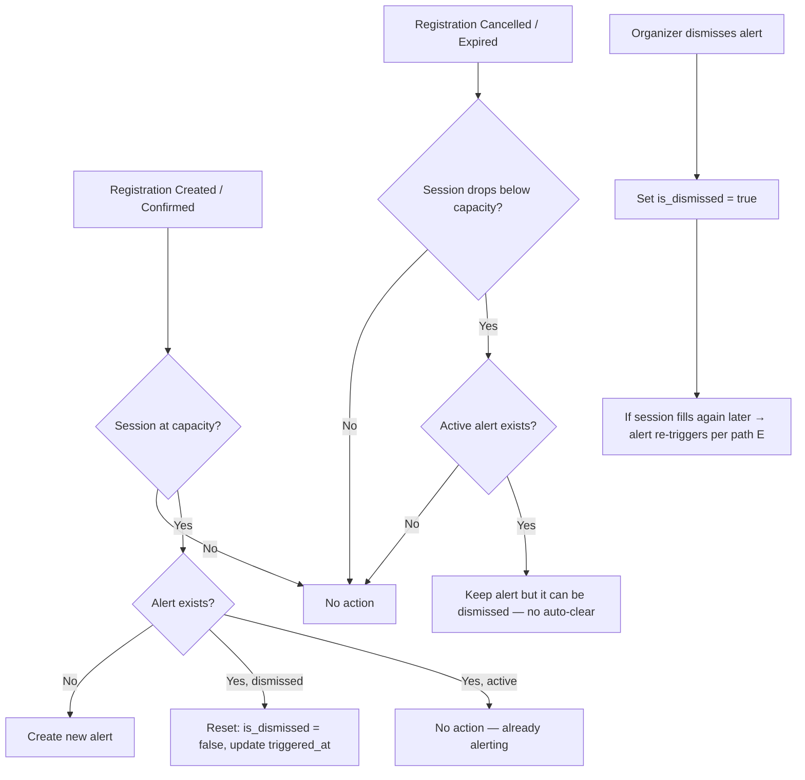

# Phase 4 — Dashboard, Audit Trail & At-Capacity Alerts

> **Goals Covered:** #8 (Dashboard), #9 (Immutable History), #10 (At-Capacity Alerts)
> **Estimated Time:** ~2 hours
> **Priority:** 🟡 High — completes the feature set
> **Depends On:** Phase 3 complete

---

## Objectives

1. Build the analytics dashboard with live headline numbers and charts.
2. Implement an append-only, immutable audit log for every registration event.
3. Build the at-capacity alert system with dismissible notifications and re-triggering logic.

---

## 4.1 — Dashboard Analytics

### Landing Page: `/dashboard`

This is the default landing page after login. It shows at-a-glance operational data.

### Headline Cards (Top Row)

| Metric                          | Query Logic                                                                                     |
| ------------------------------- | ----------------------------------------------------------------------------------------------- |
| **Sessions Today**              | `COUNT(sessions) WHERE DATE(start_time) = CURRENT_DATE`                                        |
| **Checked In Today**            | `COUNT(registrations) WHERE status = 'checked_in' AND DATE(checked_in_at) = CURRENT_DATE`      |
| **Expired This Week**           | `COUNT(registrations) WHERE status = 'expired' AND expired_at >= start_of_week`                |
| **Sessions At Capacity**        | Sessions where active registrations = capacity                                                  |

### Breakdown Charts

#### Registration Status Breakdown (Donut/Pie Chart)

```sql
SELECT status, COUNT(*) as count
FROM registrations
GROUP BY status;
```

Renders as a donut chart: Reserved (blue), Confirmed (green), Checked In (purple), Cancelled (grey), Expired (orange).

#### Registrations by Session (Horizontal Bar Chart)

```sql
SELECT s.title, COUNT(r.id) as registration_count
FROM sessions s
LEFT JOIN registrations r ON r.session_id = s.id
  AND r.status IN ('reserved', 'confirmed', 'checked_in')
GROUP BY s.id, s.title
ORDER BY registration_count DESC
LIMIT 10;
```

Top 10 sessions by active registration count, with capacity overlaid as a reference line.

#### Check-ins Per Day — Last 14 Days (Line/Bar Chart)

```sql
SELECT DATE(checked_in_at) as day, COUNT(*) as checkins
FROM registrations
WHERE status = 'checked_in'
  AND checked_in_at >= CURRENT_DATE - INTERVAL '14 days'
GROUP BY DATE(checked_in_at)
ORDER BY day;
```

Line chart with data points for each of the last 14 days. Fill zero for days with no check-ins.

### API Endpoint

```
GET /api/dashboard
```

### Response Shape

```json
{
  "success": true,
  "data": {
    "headlines": {
      "sessionsToday": 5,
      "checkedInToday": 47,
      "expiredThisWeek": 12,
      "sessionsAtCapacity": 2
    },
    "statusBreakdown": [
      { "status": "reserved", "count": 30 },
      { "status": "confirmed", "count": 85 },
      { "status": "checked_in", "count": 120 },
      { "status": "cancelled", "count": 15 },
      { "status": "expired", "count": 22 }
    ],
    "registrationsBySession": [
      { "sessionId": "...", "title": "Keynote", "count": 45, "capacity": 50 }
    ],
    "checkinsPerDay": [
      { "date": "2026-08-20", "count": 12 },
      { "date": "2026-08-21", "count": 8 }
    ]
  }
}
```

### Frontend: Chart Library

Use **Recharts** (built for React, composable, responsive):

```bash
npm install recharts
```

| Chart Type                    | Recharts Component                |
| ----------------------------- | --------------------------------- |
| Status breakdown (donut)      | `<PieChart>` with `innerRadius`   |
| Registrations by session      | `<BarChart layout="vertical">`    |
| Check-ins per day (14-day)    | `<AreaChart>` or `<LineChart>`    |

### Dashboard Layout

```
┌──────────────────────────────────────────────────────────┐
│                     HEADLINE CARDS                       │
│  ┌──────────┐ ┌──────────┐ ┌──────────┐ ┌──────────┐   │
│  │Sessions  │ │Checked In│ │ Expired  │ │At Capacity│   │
│  │ Today: 5 │ │Today: 47 │ │Week: 12  │ │    2     │   │
│  └──────────┘ └──────────┘ └──────────┘ └──────────┘   │
├────────────────────────────┬─────────────────────────────┤
│  Status Breakdown (Donut)  │  Registrations by Session   │
│       ╭───╮                │  ████████████░░ Keynote     │
│      ╱     ╲               │  ██████████░░░░ Workshop A  │
│     ╱  272  ╲              │  ████████░░░░░░ Panel       │
│      ╲     ╱               │                             │
│       ╰───╯                │                             │
├────────────────────────────┴─────────────────────────────┤
│              Check-ins Per Day (14-Day Line Chart)       │
│    12│    ╱╲                                             │
│     8│   ╱  ╲    ╱╲                                     │
│     4│──╱    ╲──╱  ╲──                                  │
│     0└──────────────────────────────────────────         │
│       Aug 20  22  24  26  28  30  Sep 01                │
└──────────────────────────────────────────────────────────┘
```

> [!NOTE]
> Staff users see the same dashboard but scoped to only their assigned sessions.
> The API must filter data based on the requesting user's role and assignments.

---

## 4.2 — Immutable Audit Trail

### Database Table

```sql
CREATE TABLE audit_log (
  id              UUID PRIMARY KEY DEFAULT gen_random_uuid(),
  registration_id UUID NOT NULL REFERENCES registrations(id) ON DELETE CASCADE,
  action          VARCHAR(50) NOT NULL,
  -- e.g., 'created', 'confirmed', 'checked_in', 'cancelled', 'expired', 'note_added'
  old_status      VARCHAR(20),
  new_status      VARCHAR(20),
  note            TEXT,
  performed_by    UUID REFERENCES users(id),   -- NULL for system actions (auto-expire)
  performed_at    TIMESTAMPTZ DEFAULT NOW()
);

CREATE INDEX idx_audit_registration ON audit_log(registration_id);
CREATE INDEX idx_audit_performed_at ON audit_log(performed_at);
```

> [!CAUTION]
> **Immutability enforcement:**
> - There are NO `UPDATE` or `DELETE` API endpoints for audit log entries.
> - The application code must NEVER issue `UPDATE` or `DELETE` on the `audit_log` table.
> - Consider a database trigger or policy to deny `UPDATE`/`DELETE` statements:
> ```sql
> CREATE RULE audit_log_no_update AS ON UPDATE TO audit_log DO INSTEAD NOTHING;
> CREATE RULE audit_log_no_delete AS ON DELETE TO audit_log DO INSTEAD NOTHING;
> ```
> - Even organizers cannot modify or remove audit entries.

### When Audit Entries Are Created

| Event                      | `action`          | `old_status` | `new_status` | `performed_by` |
| -------------------------- | ----------------- | ------------ | ------------ | --------------- |
| Registration created       | `created`         | `null`       | `reserved`   | User ID         |
| Reservation confirmed      | `status_changed`  | `reserved`   | `confirmed`  | User ID         |
| Attendee checked in        | `status_changed`  | `confirmed`  | `checked_in` | User ID         |
| Registration cancelled     | `status_changed`  | `*`          | `cancelled`  | User ID         |
| Reservation auto-expired   | `status_changed`  | `reserved`   | `expired`    | `null` (system) |
| Note added by staff        | `note_added`      | `null`       | `null`       | User ID         |
| Bulk imported              | `created`         | `null`       | `reserved`   | User ID         |

### Integration Points

Every function that changes a registration's state must also insert an audit log entry **within the same database transaction**:

```typescript
await prisma.$transaction([
  prisma.registration.update({
    where: { id: registrationId },
    data: { status: 'confirmed', confirmed_at: new Date() }
  }),
  prisma.auditLog.create({
    data: {
      registration_id: registrationId,
      action: 'status_changed',
      old_status: 'reserved',
      new_status: 'confirmed',
      performed_by: userId
    }
  })
]);
```

### Add Staff Notes

| Method | Endpoint                              | Description               | Roles                     |
| ------ | ------------------------------------- | ------------------------- | ------------------------- |
| POST   | `/api/registrations/:id/notes`        | Add a note to a registration | Organizer, Assigned Staff |

```json
// Request
{ "note": "Attendee called to confirm dietary requirements" }

// Creates an audit_log entry with action = 'note_added'
```

### API: Get Registration Timeline

```
GET /api/registrations/:id/timeline
```

```json
{
  "success": true,
  "data": [
    {
      "id": "...",
      "action": "created",
      "old_status": null,
      "new_status": "reserved",
      "note": null,
      "performed_by": { "id": "...", "full_name": "Admin User" },
      "performed_at": "2026-09-01T10:00:00Z"
    },
    {
      "id": "...",
      "action": "status_changed",
      "old_status": "reserved",
      "new_status": "confirmed",
      "note": null,
      "performed_by": { "id": "...", "full_name": "Admin User" },
      "performed_at": "2026-09-01T12:00:00Z"
    },
    {
      "id": "...",
      "action": "note_added",
      "old_status": null,
      "new_status": null,
      "note": "Attendee confirmed dietary requirements",
      "performed_by": { "id": "...", "full_name": "Staff Member" },
      "performed_at": "2026-09-01T14:30:00Z"
    }
  ]
}
```

### Frontend: Registration Timeline UI

On the **Registration Detail** page, display a vertical timeline:

```
┌─────────────────────────────────────────────────────┐
│  Registration: John Doe (john@example.com)          │
│  Session: Keynote Address                           │
│  Current Status: ● Confirmed                       │
├─────────────────────────────────────────────────────┤
│                                                     │
│  ● Sep 1, 10:00 AM — Created                       │
│  │  Reserved by Admin User                          │
│  │                                                  │
│  ● Sep 1, 12:00 PM — Status Changed                │
│  │  Reserved → Confirmed by Admin User              │
│  │                                                  │
│  ● Sep 1, 2:30 PM — Note Added                     │
│  │  "Attendee confirmed dietary requirements"       │
│  │  by Staff Member                                 │
│  │                                                  │
│  ○ ─── now ─────────────────────────                │
│                                                     │
│  ┌─────────────────────────────────┐                │
│  │ Add a note...            [Send] │                │
│  └─────────────────────────────────┘                │
└─────────────────────────────────────────────────────┘
```

---

## 4.3 — At-Capacity Alert System

### Database Table

```sql
CREATE TABLE capacity_alerts (
  id              UUID PRIMARY KEY DEFAULT gen_random_uuid(),
  session_id      UUID NOT NULL REFERENCES sessions(id) ON DELETE CASCADE,
  is_dismissed    BOOLEAN DEFAULT FALSE,
  dismissed_by    UUID REFERENCES users(id),
  dismissed_at    TIMESTAMPTZ,
  triggered_at    TIMESTAMPTZ DEFAULT NOW(),

  CONSTRAINT uq_alert_session UNIQUE (session_id)
);

CREATE INDEX idx_alerts_active ON capacity_alerts(is_dismissed) WHERE is_dismissed = FALSE;
```

### Alert Lifecycle Logic



### Key Rule

> [!IMPORTANT]
> If an organizer dismisses an at-capacity alert and a subsequent cancellation/expiry frees a seat,
> the alert does **not** automatically reappear. It only reappears if the session fills **back up**
> to capacity again after the seat was freed. Specifically:
> 1. Session at capacity → alert triggered.
> 2. Organizer dismisses → alert dismissed.
> 3. Cancellation frees a seat → nothing happens (session is now below capacity).
> 4. New registration fills it again → alert re-triggers (dismissed reset to false).

### Alert Trigger Points

Embed alert checks into the registration state transition functions:

```typescript
async function checkAndTriggerAlert(sessionId: string) {
  const session = await prisma.session.findUnique({ where: { id: sessionId } });
  const activeCount = await prisma.registration.count({
    where: { session_id: sessionId, status: { in: ['reserved', 'confirmed', 'checked_in'] } }
  });

  if (activeCount >= session.capacity) {
    // Upsert: create if not exists, or reset dismissed if exists
    await prisma.capacityAlert.upsert({
      where: { session_id: sessionId },
      create: { session_id: sessionId },
      update: { is_dismissed: false, triggered_at: new Date(), dismissed_by: null, dismissed_at: null }
    });
  }
}
```

### API Endpoints

| Method | Endpoint                        | Description                     | Roles     |
| ------ | ------------------------------- | ------------------------------- | --------- |
| GET    | `/api/alerts`                   | List all active (non-dismissed) alerts | All Auth |
| GET    | `/api/alerts/count`             | Get count of active alerts      | All Auth  |
| PATCH  | `/api/alerts/:id/dismiss`       | Dismiss an alert                | Organizer |

### Frontend: Alert Badge & Panel

#### Navigation Badge

```
┌──────────────────────────────────────┐
│  🏠 Dashboard                        │
│  📅 Events                           │
│  📋 Registrations                    │
│  🔔 Alerts (3)  ← red badge         │
│  👤 My Sessions (staff only)         │
└──────────────────────────────────────┘
```

- The badge count updates via polling every 30 seconds or via a React Query refetch interval.
- Badge disappears when count is 0.

#### Alerts Page/Panel

```
┌─────────────────────────────────────────────────────────┐
│  🔔 At-Capacity Alerts                                  │
├─────────────────────────────────────────────────────────┤
│                                                         │
│  ⚠️  Keynote Address — Tech Summit 2026                 │
│      50/50 seats filled · Triggered 10 min ago          │
│      [View Session]  [Dismiss]                          │
│                                                         │
│  ⚠️  Advanced React Workshop — Tech Summit 2026         │
│      30/30 seats filled · Triggered 2 hours ago         │
│      [View Session]  [Dismiss]                          │
│                                                         │
└─────────────────────────────────────────────────────────┘
```

---

## 4.4 — Phase 4 Deliverables Checklist

- [ ] `audit_log` table migrated with immutability rules/triggers
- [ ] `capacity_alerts` table migrated
- [ ] Dashboard API aggregating all headline numbers and chart data
- [ ] Dashboard page with 4 headline cards
- [ ] Status breakdown donut/pie chart
- [ ] Registrations by session bar chart
- [ ] 14-day check-ins line chart
- [ ] Dashboard scoped to assigned sessions for staff
- [ ] Audit log entries created for every state change (in same transaction)
- [ ] Staff notes API and UI
- [ ] Registration timeline page showing immutable history
- [ ] No update/delete endpoints for audit log (verified)
- [ ] At-capacity alert trigger logic in registration state changes
- [ ] Alert badge in navigation with live count
- [ ] Alerts page/panel with dismiss functionality (organizer-only)
- [ ] Alert re-trigger when dismissed session fills back up
- [ ] Update the expiry background job (Phase 2) to create audit entries

---

> [!TIP]
> **Commit strategy for Phase 4:**
> 1. `feat: add audit_log table with immutability rules`
> 2. `feat: integrate audit logging into all registration state transitions`
> 3. `feat: add staff notes to registration timeline`
> 4. `feat: build registration timeline UI`
> 5. `feat: implement dashboard API with aggregated metrics`
> 6. `feat: build dashboard page with charts (Recharts)`
> 7. `feat: add capacity_alerts table and trigger logic`
> 8. `feat: build alert badge and dismissible alert panel`
> 9. `test: verify audit log immutability and alert re-trigger logic`
