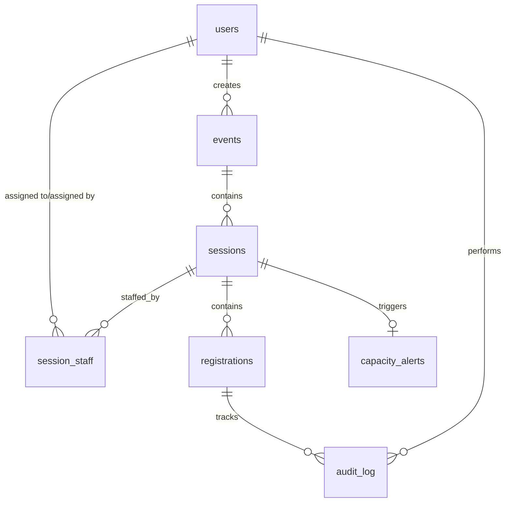

# Database Schema

## Entity Relationship Diagram (ERD)

## Tables

### `users`
- **id**: UUID (PK)
- **email**: String (Unique)
- **passwordHash**: String
- **fullName**: String
- **role**: Enum (ORGANIZER, CHECK_IN_STAFF)
- **isActive**: Boolean

### `events`
- **id**: UUID (PK)
- **name**: String
- **description**: Text
- **venue**: String
- **startDate**: DateTime
- **endDate**: DateTime
- **isArchived**: Boolean
- **createdById**: UUID (FK -> users)

### `sessions`
- **id**: UUID (PK)
- **eventId**: UUID (FK -> events, Cascade)
- **title**: String
- **startTime**: DateTime
- **durationMin**: Int
- **location**: String
- **capacity**: Int

### `registrations`
- **id**: UUID (PK)
- **sessionId**: UUID (FK -> sessions, Cascade)
- **attendeeName**: String
- **attendeeEmail**: String
- **status**: String
- **reservedAt**: DateTime
- **confirmedAt**: DateTime
- **checkedInAt**: DateTime
- **cancelledAt**: DateTime
- **expiredAt**: DateTime

### `session_staff`
- **id**: UUID (PK)
- **sessionId**: UUID (FK -> sessions, Cascade)
- **userId**: UUID (FK -> users, Cascade)
- **assignedById**: UUID (FK -> users)

### `audit_log`
- **id**: UUID (PK)
- **registrationId**: UUID (FK -> registrations, Cascade)
- **action**: String
- **oldStatus**: String
- **newStatus**: String
- **note**: Text
- **performedById**: UUID (FK -> users)

### `capacity_alerts`
- **id**: UUID (PK)
- **sessionId**: UUID (Unique, FK -> sessions, Cascade)
- **isDismissed**: Boolean
- **dismissedById**: UUID (FK -> users)

## Constraints
- **Database Level**: Foreign keys with cascading deletes, unique constraints on `email`, `session_staff(sessionId, userId)`, `capacity_alerts(sessionId)`.
- **Application Level**: Registration state machine transitions, capacity limits per session, role-based access.

## Scalability Limits
At 100x data, full-text search on `attendeeName` and `attendeeEmail` using generic `LIKE` queries will degrade. We will need to implement `pg_trgm` (trigram indices) or dedicated search engines (e.g., Elasticsearch). Dashboard aggregations (e.g. counting check-ins across thousands of events) will also become slow and might require materialized views.
